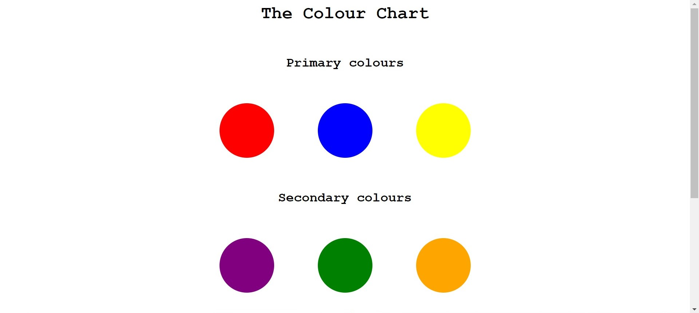
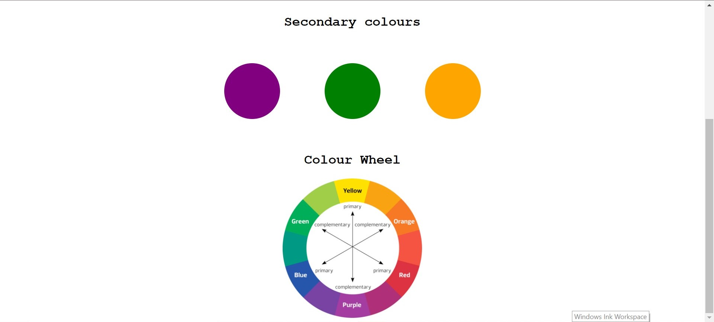

# CodeCell MonthOfMERN Week0

## Task0

### TODO

- [x] create a heading `The Colour Chart`
- [x] create subheadings `Primary Colors`, `Secondary Colors` and `Color Wheel` 
- [x] The chart should have circular elements
  - [x] Primary Colours
  - [x] Secondary Colours
- [x] embed an image as present in your `task0/assets` folder for the colour wheel

## Example Result

